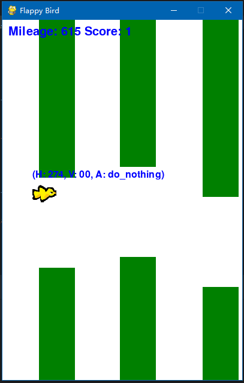

# Flappy Bird DQN Coursework Project

A reinforcement-learning coursework project using a Pygame/Gymnasium Flappy Bird environment and a PyTorch MLP Q-network. `my_agent.py` implements epsilon-greedy action selection, replay storage and a separate periodically updated target network for jump/do-nothing decisions.

## Attribution and repository status

The environment and supporting assignment materials are credited to Dr Zhibin Liao, University of Adelaide, for the 2025 Artificial Intelligence assignment. Several source headers explicitly state that public distribution is forbidden. This README does not override those notices or establish permission to redistribute the coursework materials. Confirm permission with the material’s owner before using this as a public portfolio distribution; no license or permission is inferred from the repository being accessible.

## Existing entry points

Use an isolated environment and the actual singular requirements filename:

```bash
python -m venv .venv
source .venv/bin/activate
python -m pip install -r requirement.txt
# Human-play smoke check:
python play_game.py --level 1
# Agent training (long-running; not a quick inference demo):
python my_agent.py --level 4
```

The agent entry point runs **10,000 training episodes**, writes/overwrites `my_model.ckpt` after each episode, then performs a ten-episode evaluation. Back up an existing checkpoint before running it. There is no separate evaluation-only CLI in the checked-in script; evaluation behavior is selected programmatically through `MyAgent(mode='eval', load_model_path=...)`. Only load a checkpoint you trust.

## Configuration and evidence

`config.yml` defines game levels, physics, rendering and environment seed. The script’s training invocation explicitly enables the game window; do not assume the YAML’s `show_screen: false` makes this entry point headless. Levels and game-length settings affect results.

The repository includes a checkpoint but no frozen multi-seed evaluation report, checkpoint provenance or documented performance comparison. Do not infer success rates, average scores or generalization from the presence of weights. The implementation and historical coursework remain the evidence available here; this documentation refresh does not retrain or evaluate the agent.

## Repository map

- `my_agent.py`: agent, training loop and subsequent ten-episode evaluation.
- `pytorch_mlp.py`: MLP training/prediction and checkpoint helpers.
- `console.py`, `clock.py`, `config.yml`: supplied environment and timing/configuration.
- `play_game.py`, `human_agent.py`: human-play interface.
- `requirement.txt`: supplied dependencies; see [installation notes](documentation/INSTALLATION.md).
- [Original assignment description](documentation/ASSIGNMENT_DESCRIPTION.md), [game information](documentation/GAME_INFORMATION.MD), [assessment](documentation/ASSESSMENT_DESCRIPTION.md) and [advice](documentation/HELPFUL_ADVICE.md): retained coursework context.


